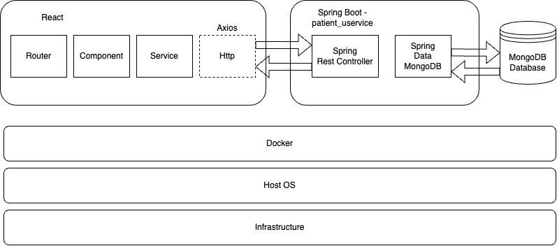

# Application Architecture Overview

The architecture diagram represents a web application system using a microservices architecture pattern. Below is the breakdown of its components and their interactions.

## Frontend

### React

- **Router**: Manages client-side routing, enabling navigation between different UI components without page reloads.
- **Component**: The building blocks of the UI, each managing its state and composing the overall behavior of the application.
- **Service**: Encapsulates business logic and external service interactions, such as making HTTP requests.
- **Axios**: A promise-based HTTP client used within the service layer to make requests to the backend.

## Backend

### Spring Boot

- **Spring Rest Controller**: Part of Spring MVC, it defines endpoints for the frontend to consume, handling HTTP requests and responses.
- **Spring Data MongoDB**: The data access layer that interacts with the MongoDB database using Spring Data's repository pattern.

## Database

- **MongoDB Database**: A NoSQL database that stores application data, renowned for its flexible document structure and scalability.

## Containerization

- **Docker**: Utilized to containerize the React and Spring Boot application, ensuring consistent environments across development and deployment.

## Infrastructure

- **Host OS**: The operating system that runs Docker, such as Linux, Windows, or macOS.
- **Physical or Virtual Infrastructure**: The underlying hardware or cloud infrastructure hosting the OS and Docker containers.

Data and request flow is indicated by arrows. The React frontend makes HTTP requests to the Spring Boot backend, which then communicates with the MongoDB database to perform CRUD operations.

